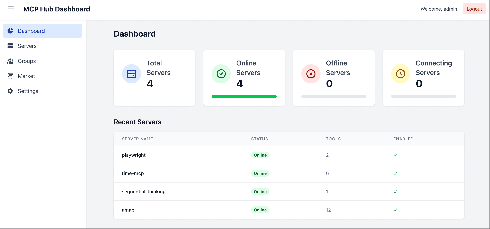

# xiaozhi-mcphub：为小智AI平台优化的MCP工具桥接系统

[English Version](README.md) | 中文版

**xiaozhi-mcphub** 是一个专为小智AI平台优化的智能MCP（Model Context Protocol）工具桥接系统。基于优秀的 [MCPHub](https://github.com/samanhappy/mcphub) 项目开发，增加了小智平台集成和智能工具同步功能。



## 🚀 核心功能

### 🤖 **小智AI平台集成** *(新功能!)*
- **原生小智连接**：通过WebSocket实现自动工具同步
- **实时工具更新**：工具状态变化时智能重连
- **协议桥接**：为小智平台提供无缝的MCP协议转换
- **工具发现**：基于向量的智能工具搜索路由

### 🛠️ **增强的MCP管理** *(基于MCPHub)*
- **广泛的MCP服务器支持**：无缝集成任何MCP服务器，配置简单
- **集中式管理控制台**：在一个简洁的Web UI中实时监控所有服务器的状态和性能指标
- **灵活的协议兼容**：完全支持stdio、SSE和HTTP MCP协议
- **热插拔式配置**：在运行时动态添加、移除或更新服务器配置，无需停机
- **基于分组的访问控制**：自定义分组并管理服务器访问权限
- **安全认证机制**：内置用户管理，基于JWT和bcrypt，实现角色权限控制
- **Docker就绪**：提供容器化镜像，快速部署

## 🎯 xiaozhi-mcphub的独特优势

与原始MCPHub专注于服务器管理不同，**xiaozhi-mcphub** 专门为小智AI平台集成进行了优化：

✅ **自动工具同步** - 工具启用/禁用时自动同步到小智平台  
✅ **智能重连机制** - 确保小智平台始终获得最新的工具状态  
✅ **小智优先设计** - 基于WebSocket的架构专为小智平台通信优化  
✅ **增强日志记录** - 详细记录小智平台交互和工具使用情况  

## 🔧 快速开始

### 小智集成设置

1. **配置小智连接**：
```json
{
  "xiaozhi": {
    "enabled": true,
    "webSocketUrl": "wss://api.xiaozhi.me/mcp/?token=your-jwt-token",
    "reconnect": {
      "maxAttempts": 10,
      "initialDelay": 2000,
      "maxDelay": 60000,
      "backoffMultiplier": 2
    }
  }
}
```

2. **添加到 mcp_settings.json**：
```json
{
  "mcpServers": {
    "amap": {
      "command": "npx",
      "args": ["-y", "@amap/amap-maps-mcp-server"],
      "env": {
        "AMAP_MAPS_API_KEY": "your-api-key"
      }
    },
    "playwright": {
      "command": "npx",
      "args": ["@playwright/mcp@latest", "--headless"]
    },
    "fetch": {
      "command": "uvx",
      "args": ["mcp-server-fetch"]
    },
    "slack": {
      "command": "npx",
      "args": ["-y", "@modelcontextprotocol/server-slack"],
      "env": {
        "SLACK_BOT_TOKEN": "your-bot-token",
        "SLACK_TEAM_ID": "your-team-id"
      }
    }
  },
  "xiaozhi": {
    "enabled": true,
    "webSocketUrl": "wss://api.xiaozhi.me/mcp/?token=your-jwt-token"
  }
}
```

### Docker 部署

```bash
# 使用自定义配置
docker run -p 3000:3000 \
  -v ./mcp_settings.json:/app/mcp_settings.json \
  -v ./data:/app/data \
  huangjunsen/xiaozhi-mcphub

# 使用默认配置
docker run -p 3000:3000 huangjunsen/xiaozhi-mcphub
```

### 访问控制台

打开 `http://localhost:3000`，使用默认凭据登录：`admin` / `admin123`

**新增小智平台功能**：
- 🔌 小智连接状态和管理
- ⚡ 实时工具同步监控  
- 🔄 自动重连控制
- 📊 小智平台使用统计

## 🌐 API 端点

### 传统MCP端点
```
http://localhost:3000/mcp          # 统一端点，支持所有服务器
http://localhost:3000/mcp/$smart   # 基于向量搜索的智能路由  
http://localhost:3000/mcp/{group}  # 分组特定端点
http://localhost:3000/mcp/{server} # 服务器特定端点
```

### 小智平台管理 *(新功能!)*
```
GET    /api/xiaozhi/status     # 获取连接状态
GET    /api/xiaozhi/config     # 获取配置（token已遮盖）
PUT    /api/xiaozhi/config     # 更新配置
POST   /api/xiaozhi/restart    # 重启客户端连接
POST   /api/xiaozhi/start      # 启动客户端
POST   /api/xiaozhi/stop       # 停止客户端
```

## 🧑‍💻 本地开发

```bash
git clone https://github.com/huangjunsen0406/xiaozhi-mcphub.git
cd xiaozhi-mcphub
pnpm install
pnpm dev
```

此命令将在开发模式下启动前后端，并启用热重载。

## 📊 小智工具集成

xiaozhi-mcphub 成功为小智AI平台提供强大的工具支持：

### 🎭 网页自动化 (Playwright)
- 浏览器控制、页面交互、内容捕获
- 截图和PDF生成  
- 标签页管理和自动化测试

### 🌐 网络工具 (Fetch)
- 网页内容获取和Markdown转换

### 💬 通信工具 (Slack)  
- 频道管理、消息发送、用户交互
- 线程回复和表情反应

### 🗺️ 位置服务 (Amap)
- 地理编码、搜索、路由、天气
- 兴趣点发现

## 📄 项目归属

本项目基于 [MCPHub](https://github.com/samanhappy/mcphub)（由 samanhappy 和贡献者开发）进行开发，遵循 Apache License 2.0 许可证。

**xiaozhi-mcphub 的主要增强功能：**
- ✨ 小智AI平台集成  
- 🔄 增强的工具同步机制
- 🔗 改进的小智客户端重连逻辑
- 📡 扩展的小智平台管理API端点

## 📜 许可证

本项目采用 Apache License 2.0 许可证。详见 [LICENSE](LICENSE) 文件。

## 🤝 贡献

欢迎提交 Pull Request 来改进项目！

## 🔗 相关链接

- [原始 MCPHub 项目](https://github.com/samanhappy/mcphub)
- [小智AI平台](https://xiaozhi.me)
- [Model Context Protocol](https://modelcontextprotocol.io)
