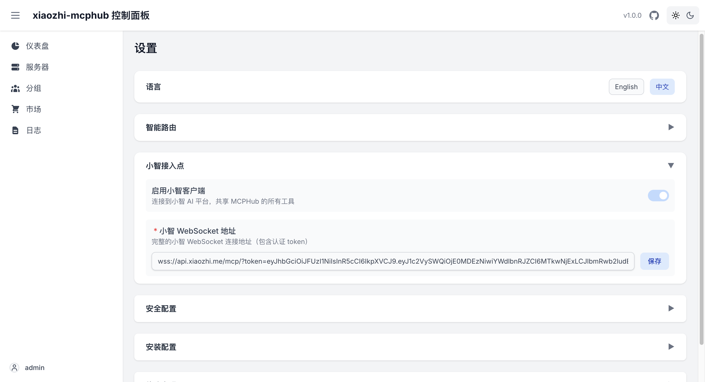

# 小智配置文档

本文档详细介绍小智（Xiaozhi AI Assistant）的配置和开发集成。

## 概述

小智是一个智能AI助手，可以通过xiaozhi-mcphub与各种MCP（Model Context Protocol）服务器进行集成。

## 基本配置

### 小智平台集成


- 右下角admin位置点击选择设置进入就能看到了
- 可以通过ui修改也可以通过下面的配置修改

在 `mcp_settings.json` 中配置小智平台连接：

```json
{
  "xiaozhi": {
    "enabled": true,
    "webSocketUrl": "wss://api.xiaozhi.ai/ws",
    "reconnect": {
      "maxAttempts": 10,
      "initialDelay": 2000,
      "maxDelay": 60000,
      "backoffMultiplier": 2
    }
  }
}
```

### 配置参数说明

| 参数 | 类型 | 默认值 | 描述 |
|------|------|--------|------|
| `enabled` | boolean | `true` | 是否启用小智平台集成 |
| `webSocketUrl` | string | - | 小智平台WebSocket连接URL |
| `reconnect.maxAttempts` | number | `10` | 最大重连尝试次数 |
| `reconnect.initialDelay` | number | `2000` | 初始重连延迟（毫秒） |
| `reconnect.maxDelay` | number | `60000` | 最大重连延迟（毫秒） |
| `reconnect.backoffMultiplier` | number | `2` | 重连延迟增长倍数 |
