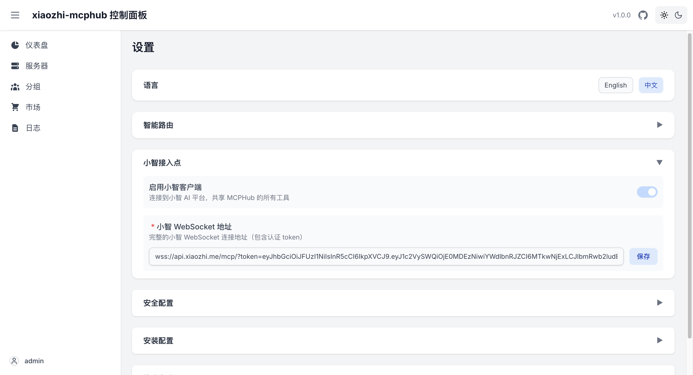

# 小智接入

xiaozhi-mcphub 通过 **WebSocket 多端点** 与小智 AI 平台对接：每个登录用户管理自己的端点列表，可绑定分组或启用智能路由。

## 前置条件

- 配置 **`DB_URL`**（小智端点持久化依赖数据库）  
- 控制台已登录  
- 小智侧提供可连的 `wss://...` 地址（含 token 等查询参数时，界面会脱敏展示）

## 在控制台操作

1. 侧栏进入 **小智**  
2. **添加端点**：名称、WebSocket URL、是否启用、分组 / 智能路由、重连参数  
3. 可对单个端点：启用/禁用、编辑、重连、删除  
4. 顶部状态（服务状态、总端点数、已启用、已连接）由**当前用户可见端点**聚合，**不再**使用全局「总开关」切断连接  

管理员可看到全部端点；普通用户仅自己的。无 owner 的遗留端点视为管理员资源。

## 配置字段（概念）

| 字段 | 说明 |
|------|------|
| 名称 | 展示名 |
| WebSocket URL | 小智下发的接入地址 |
| 启用 | 是否参与连接 |
| 分组 | 可选，限制工具集；或「无分组」 |
| 智能路由 | 使用 `$smart` 语义检索工具 |
| 重连 | 初始延迟、最大次数、最大延迟、退避倍数等 |

也可用环境变量调节**进程级**重连行为（见 [环境变量](/configuration/environment-variables) 小智一节）。

## 与 MCP 工具同步

当 MCP 服务器工具列表变化时，服务会通知已连接的小智端点，保持工具清单大致同步（视连接状态与实现而定）。

## 仪表盘

主仪表盘也会展示小智相关摘要（服务是否有启用端点、端点数量、连接数等），并与服务器列表、MCP 接入 URL 同页展示。

## 兼容说明（1.1.0）

- 旧版「实例级 enabled 总开关」**不再作为连接门闸**；`updateXiaozhiConfig` 类接口会批量切换**当前用户**端点  
- 管理员仍可能看到诊断用的 legacy 全局标记，但不控制连接  
- API 返回的 `enabled` 对用户表示「其名下是否有启用中的端点」  

## 故障排除

| 现象 | 建议 |
|------|------|
| 页面报错 / 空列表 | 检查 `DB_URL`、迁移是否成功 |
| 一直断开 | 检查 URL/token、网络、重连参数；看后端日志 |
| 工具不全 | 确认绑定分组是否过窄；服务器是否在线；是否应开智能路由 |
| 非管理员看不见某端点 | 是否 owner 不匹配（隔离预期行为） |
