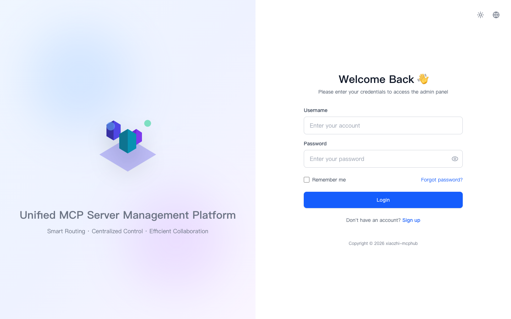
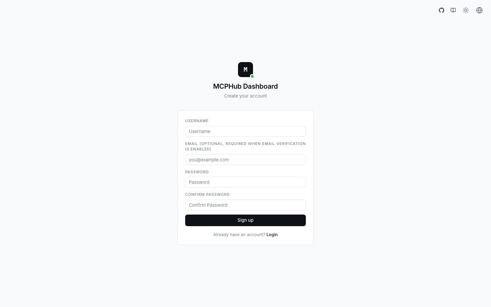
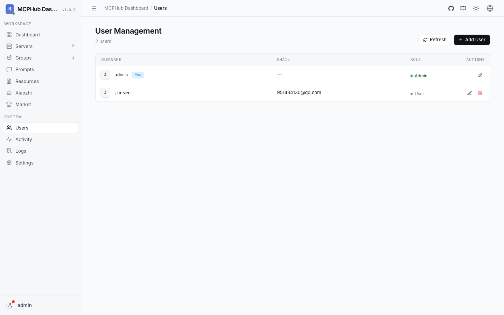

# 认证与多账户

xiaozhi-mcphub **1.1.0** 在 JWT 控制台登录之外，支持注册、邮箱验证、找回密码，以及按 **owner** 隔离的 Server / Group / 小智端点数据。

## 登录与注册

| 能力 | 说明 |
|------|------|
| 登录 | 用户名 + 密码；可选「记住账号」 |
| 注册 | `/register`；若启用邮件服务，可能要求邮箱并验证后才能登录 |
| 找回密码 | 邮件服务启用时可用；重置链接打开「设置新密码」 |
| 社交登录 | 可选 Better Auth（GitHub / Google / OIDC），需 DB |

### 密码强度

前后端统一规则（稳定错误码 + i18n）：

- 至少 **8** 位  
- 至少一个字母、一个数字、一个特殊字符  

中文界面会显示「密码不符合安全要求」等本地化文案，而不是英文原文。

### 默认管理员

- 本地 `pnpm dev`：常见 `admin` / `admin123`（请尽快修改）  
- 其它启动：可用 `ADMIN_PASSWORD` 仅在**首次空用户表**时生效；否则看启动日志中的随机密码  

## 角色与权限

| 角色 | 典型能力 |
|------|----------|
| 管理员 `isAdmin` | 所有 Server/Group/端点、用户管理、系统日志流、实例级 `dbUrl`、全局诊断 |
| 普通用户 | 仅自己的资源；设置里可改个人集成（如 ModelScope / MCPRouter）；不可越权管理他人「公开」服务器的配置 |

前端权限点包括 `settings:smart_routing`、`settings:user_integrations` 等。

## 数据隔离（1.1.0）

- **Server / Group** 唯一键为 **`(owner, name)`**，不同用户可同名  
- JSON 存储键形如 `owner::name`；遗留无 owner 资源启动时会回填为 `admin`  
- 列表接口按当前用户过滤；管理 API 优先 `findByOwnerAndName`  
- **活动日志**强制用户作用域；**系统日志 SSE** 仅管理员（前端有限重试，避免 403 刷屏）  
- 小智端点按 owner 可见；「服务启用」由当前用户端点聚合，不再使用实例总开关挡连接  

## 每用户配置

系统级仍放在 `SystemConfig`（DB URL、Better Auth、安装 baseUrl 等）。  
用户可覆盖的个人项包括（见 `UserConfig`）：

- `smartRouting`（**不可**覆盖系统 `dbUrl`）  
- `toolResultCompression`  
- `mcpRouter` / `modelscope` API 相关字段  

运行时通过 `effectiveConfig` 做 system + user 合并。

## 邮件

在 **设置** 中配置 SMTP（主机、端口、账号、发件人等）。启用后：

- 注册验证邮件  
- 密码重置邮件  
- 可发测试邮件  

未配置邮件时，注册可仍可用（视部署策略），但验证/找回不可用。

## Better Auth

见 [环境变量 · Better Auth](/configuration/environment-variables)。要点：

1. 必须 `DB_URL`  
2. 配置客户端密钥与 `BETTER_AUTH_URL`  
3. 改环境变量后需**重启**进程  

## 相关界面

