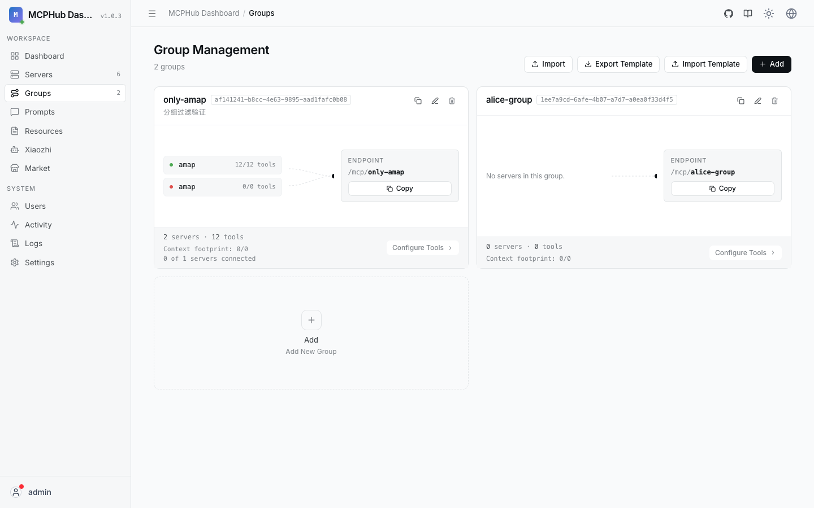

# 分组管理

分组把多个 MCP 服务器编成逻辑集合，用于：

- 客户端：`/mcp/{group}` 或用户前缀路由  
- 小智端点绑定某一组工具  

## 1.1.0 行为

- 唯一性：`(owner, name)`  
- 非管理员只能管理自己的组  
- 向组内添加服务器时，只能选择自己有权使用的服务器（自有 + 策略允许的公开服务器）  
- 遗留无 owner 的组视为管理员资源  

## 操作

在 **Groups** 页创建分组、勾选服务器、保存。仪表盘 MCP 接入区会列出分组 URL 示例。
