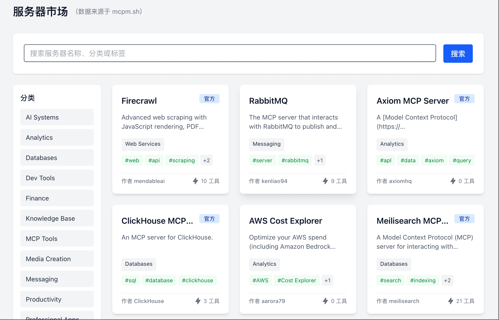

# MCP 服务器市场

## 概述

MCP 服务器市场是 XIAOZHI-MCPHUB 的核心功能之一，提供丰富的预构建 MCP 服务器集合，让您轻松发现、安装和管理各种功能强大的工具和服务。



## 市场特性

### 🔍 智能搜索和分类
- **功能分类**: 按用途分类的服务器（开发工具、数据处理、通信、AI/ML等）
- **智能推荐**: 基于您的使用历史推荐相关服务器
- **标签过滤**: 通过标签快速筛选特定类型的服务器
- **搜索功能**: 支持按名称、描述、作者等多维度搜索

### 📦 一键安装部署
- **自动配置**: 智能检测依赖并自动配置环境
- **批量安装**: 支持同时安装多个相关服务器
- **版本管理**: 自动处理版本兼容性和更新
- **依赖解析**: 自动安装所需的系统依赖

### 🛡️ 安全与质量保证
- **官方认证**: 标识官方维护和社区验证的服务器
- **安全扫描**: 自动安全扫描确保服务器安全性
- **评分系统**: 基于用户反馈的质量评分
- **更新通知**: 及时提醒服务器更新和安全补丁

## 主要服务器类别

### 开发工具类
**包含服务器**:
- `github`: GitHub 仓库操作和 CI/CD 集成
- `gitlab`: GitLab 项目管理和部署
- `docker`: 容器管理和镜像操作
- `kubernetes`: K8s 集群管理
- `firebase`: Firebase 服务集成

### 数据处理类
**包含服务器**:
- `sqlite`: 轻量级数据库操作
- `postgresql`: 高性能数据库管理
- `filesystem`: 文件系统操作
- `spreadsheet`: Excel/CSV 数据处理
- `json-processor`: JSON 数据转换

### 网络和通信类
**包含服务器**:
- `fetch`: HTTP 请求和网页抓取
- `playwright`: 浏览器自动化
- `slack`: Slack 团队协作
- `discord`: Discord 机器人集成
- `email`: 邮件发送服务

### AI 和机器学习类
**包含服务器**:
- `openai`: OpenAI API 集成
- `huggingface`: Hugging Face 模型
- `anthropic`: Claude API 服务
- `google-ai`: Google AI 服务
- `vector-db`: 向量数据库操作

### 中国本土服务类
**包含服务器**:
- `amap`: 高德地图 API
- `baidu-map`: 百度地图服务
- `wechat`: 微信开发工具
- `aliyun`: 阿里云服务集成
- `tencent-cloud`: 腾讯云 API

## 使用市场

### 浏览和搜索

1. **访问市场**: 在主导航点击"市场"进入 MCP 服务器市场
2. **浏览分类**: 使用左侧分类菜单浏览不同类型的服务器
3. **搜索功能**: 使用顶部搜索栏查找特定服务器
4. **过滤选项**: 使用过滤器缩小搜索范围

### 安装服务器

```bash
# 通过市场 UI 一键安装
# 或使用 CLI 命令
xiaozhi-mcphub market install github

# 批量安装开发工具套件
xiaozhi-mcphub market install-bundle development-tools
```

### 配置和管理

安装后的服务器会自动添加到您的配置中：

```json
{
  "mcpServers": {
    "github": {
      "command": "npx",
      "args": ["@modelcontextprotocol/server-github"],
      "env": {
        "GITHUB_PERSONAL_ACCESS_TOKEN": "your-token"
      },
      "marketSource": true,
      "version": "1.0.0"
    }
  }
}
```

## 服务器信息展示

每个服务器在市场中包含以下信息：

### 基本信息
- **名称和描述**: 服务器的功能说明
- **版本信息**: 当前版本和更新历史
- **作者信息**: 开发者和维护者
- **许可证**: 开源许可证类型

### 技术规格
- **依赖要求**: 系统和软件依赖
- **资源需求**: CPU、内存等资源要求
- **兼容性**: 支持的操作系统和环境
- **集成方式**: API 密钥、配置要求等

### 用户反馈
- **评分和评论**: 用户使用体验反馈
- **下载统计**: 安装和使用统计
- **问题报告**: 已知问题和解决方案
- **使用案例**: 实际应用场景示例

## 高级功能

### 自定义市场源

添加私有或企业市场源：

```json
{
  "marketSources": [
    {
      "name": "official",
      "url": "https://market.xiaozhi-mcphub.com",
      "type": "official"
    },
    {
      "name": "enterprise",
      "url": "https://internal-market.company.com",
      "type": "private",
      "token": "your-access-token"
    }
  ]
}
```

### 服务器打包和发布

开发者可以将自己的 MCP 服务器发布到市场：

```bash
# 打包服务器
xiaozhi-mcphub package my-server

# 发布到市场
xiaozhi-mcphub publish my-server --market official
```

### 服务器模板

使用市场提供的模板快速创建新服务器：

```bash
# 列出可用模板
xiaozhi-mcphub templates list

# 使用模板创建服务器
xiaozhi-mcphub create-server --template web-scraper --name my-scraper
```

## 更新和维护

### 自动更新

启用自动更新功能：

```json
{
  "market": {
    "autoUpdate": true,
    "updateInterval": "24h",
    "updateStrategy": "stable"
  }
}
```

### 版本管理

```bash
# 查看已安装服务器的版本
xiaozhi-mcphub list --show-versions

# 更新特定服务器
xiaozhi-mcphub update github

# 更新所有服务器
xiaozhi-mcphub update --all
```

### 回滚功能

```bash
# 回滚到上一个版本
xiaozhi-mcphub rollback github

# 回滚到特定版本
xiaozhi-mcphub rollback github --version 0.9.0
```

## 企业功能

### 私有市场

企业可以部署私有市场：

```yaml
# docker-compose.yml
version: '3.8'
services:
  private-market:
    image: xiaozhi-mcphub/private-market:latest
    environment:
      - MARKET_NAME=Enterprise Market
      - ACCESS_CONTROL=ldap
      - STORAGE_BACKEND=s3
    volumes:
      - ./market-config:/config
```

### 访问控制

配置基于角色的访问控制：

```json
{
  "marketAccess": {
    "roles": {
      "developer": {
        "canInstall": ["development", "tools"],
        "canPublish": true
      },
      "analyst": {
        "canInstall": ["data", "reporting"],
        "canPublish": false
      }
    }
  }
}
```

## 故障排除

### 常见问题

#### 安装失败
- 检查网络连接和权限
- 验证系统依赖是否满足
- 查看详细错误日志

#### 服务器无法启动
- 检查配置文件语法
- 验证 API 密钥和环境变量
- 查看服务器日志输出

#### 版本冲突
- 使用版本管理工具解决冲突
- 检查依赖兼容性
- 考虑使用虚拟环境隔离

### 调试命令

```bash
# 启用详细日志
DEBUG=xiaozhi-mcphub:market xiaozhi-mcphub market install github

# 验证服务器配置
xiaozhi-mcphub validate-config

# 测试服务器连接
xiaozhi-mcphub test-server github
```

## 贡献和反馈

### 提交服务器到市场

1. 准备服务器代码和文档
2. 通过 GitHub 提交 Pull Request
3. 等待社区审核和测试
4. 服务器发布到市场

### 报告问题

- 在 GitHub Issues 中报告 bug
- 提供详细的复现步骤
- 包含日志和环境信息
- 建议改进方案

市场功能让 XIAOZHI-MCPHUB 成为一个真正的生态平台，促进 MCP 服务器的开发、分享和协作。