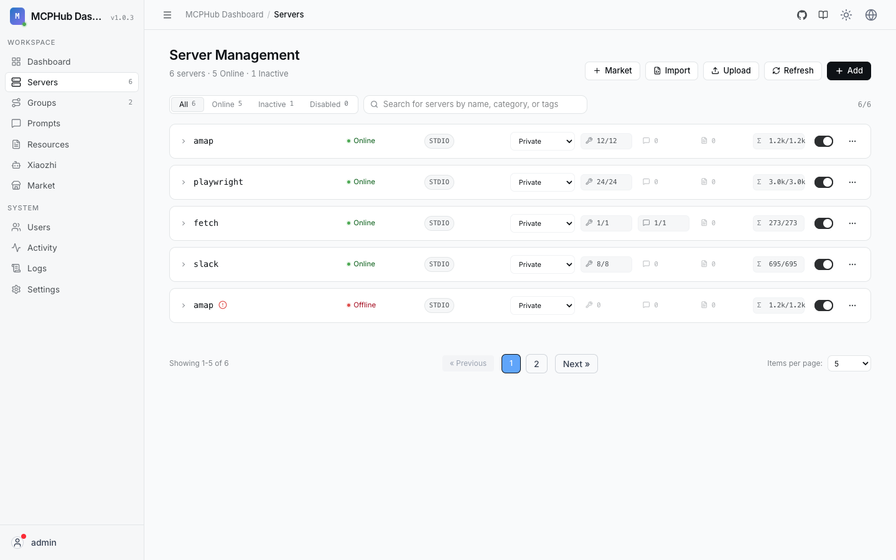
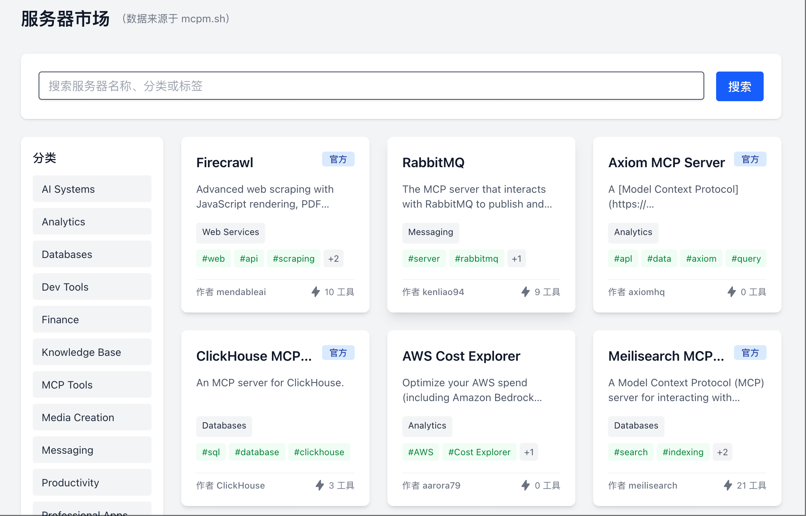

# 服务器管理

在控制台集中管理 MCP Server：添加、启停、编辑与分组。**1.1.0** 起服务器名称在 **owner 命名空间**内唯一，不同用户可使用相同显示名。



## 添加服务器

1. 打开 **Servers / 服务器** 或仪表盘 **Add**
2. 选择传输类型并填写连接信息：
   - **stdio**：command / args / env / cwd
   - **SSE / streamable-http**：URL 与请求头等
   - **OpenAPI**：规范 URL 或 schema
3. 按需设置超时、可见性、变量

使用 API 时需带 JWT：

```bash
curl -X POST http://localhost:3000/api/servers \
  -H "Authorization: Bearer <token>" \
  -H "Content-Type: application/json" \
  -d '{"name":"fetch","command":"uvx","args":["mcp-server-fetch"]}'
```

非管理员创建的服务器 `owner` 为当前用户。

## 状态监控

仪表盘展示总数 / 在线 / 连接中 / 离线，以及工具数等：


`GET /health` 也会返回连接汇总。

## 分组

将服务器编组，供小智绑定或客户端 `/mcp/{group}` 使用。分组同样按 owner 隔离。


## 市场

从市场浏览或安装模板（依赖网络与部署配置）：



## 多账户注意

- 用户 A、B 可同时拥有名为 `amap` 的服务器
- 管理 API 优先按 `(当前用户, name)` 解析
- 「公开」影响可见性，不代表他人可改配置

## ModelScope

设置中可配置用户级 ModelScope API Key；连接 ModelScope 托管 MCP 时按**服务器 owner** 的有效配置自动附加 Bearer（手动 Authorization 优先）。
