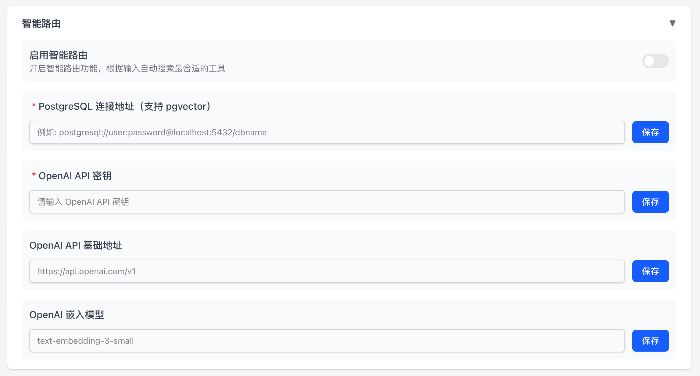
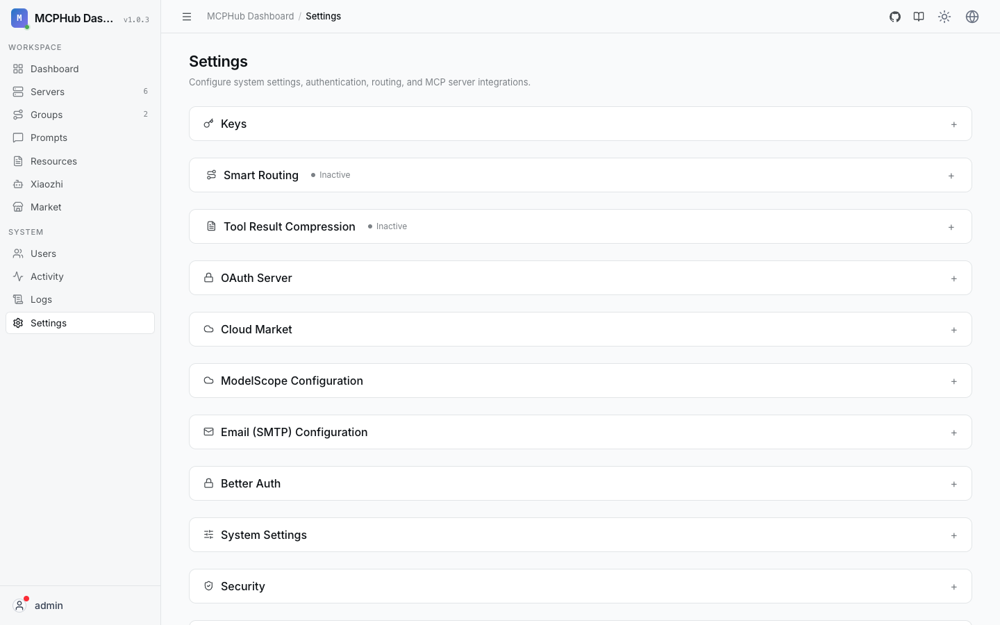

# 智能路由

智能路由用向量语义检索，按用户请求只暴露最相关的 MCP 工具，降低上下文占用。客户端可使用：

```text
http://localhost:3000/mcp/$smart
```



## 启用条件

1. PostgreSQL **带 pgvector**（通常即 `DB_URL` 指向的库）
2. 配置 Embedding：如 `OPENAI_API_KEY`、可选 `OPENAI_API_BASE_URL`、`OPENAI_API_EMBEDDING_MODEL`
3. 环境变量或设置中打开智能路由（如 `SMART_ROUTING_ENABLED=true`）

## 工作流程（简述）

1. **索引**：连接 MCP 服务器后，将工具名/描述等写入向量库  
2. **检索**：用户 prompt 向量化，top-k 相似工具  
3. **暴露**：仅相关工具进入上游模型上下文  
4. **执行**：仍由对应 MCP 服务器执行  

## 多账户与配置（1.1.0）

- **向量库连接 `dbUrl`**：实例级，**仅管理员**可在设置中查看/修改  
- 普通用户可覆盖个人 smartRouting 相关项（如开关、个人 Key），经 `effectiveConfig` 与系统配置合并  
- 小智端点可勾选「使用智能路由」，与 `$smart` 行为对齐  

## 设置界面

在 **Settings** 的 Smart Routing 区块配置；非管理员看不到/不能改全局 DB URL。



## 排查

| 问题 | 检查 |
|------|------|
| 无效果 | 客户端是否走 `/mcp/$smart`；功能是否启用 |
| 检索差 | Embedding 模型与 Key；工具描述是否空洞 |
| 写入失败 | pgvector 是否安装；DB 权限 |
